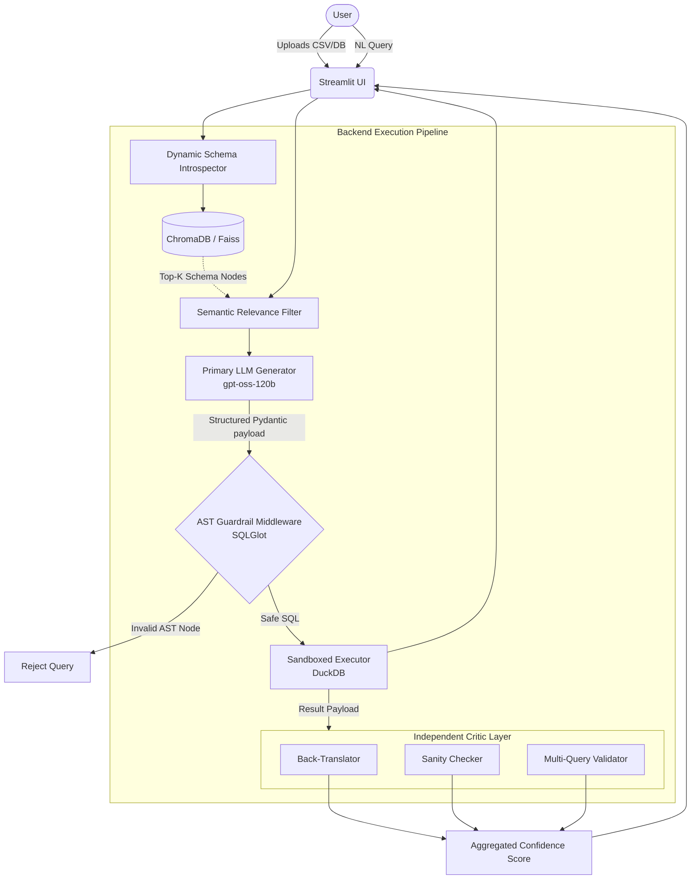

# Custos: AI-Powered SQL Generation with Safety First 🛡️


Custos is a highly-secure, read-only AI database assistant that converts natural language queries into executable SQL. Unlike traditional Text-to-SQL systems that blindly trust generative outputs, Custos implements a deterministic guardrail middleware and a secondary evaluation critic layer to prevent hallucinated queries, malicious injections (e.g., DDL/DML), and ambiguous executions.

It features a stateless, dynamic dataset ingestion pipeline. Users can upload arbitrary SQLite/DuckDB databases or CSVs on the fly, which are immediately introspected, embedded, and queried in natural language with transparent, multi-metric confidence scoring.

## 🧠 Technical Architecture & Pipeline

Custos employs a multi-agentic pipeline, rigidly isolating generation from validation to prevent correlated failures.

### 1. Schema Introspection & Semantic Search
When a database is uploaded, Custos dynamically extracts the schema (DDL) and metadata. To circumvent LLM context limits and reduce prompt bloat, Custos utilizes a local vector index:
- **Embeddings**: `sentence-transformers` (`all-MiniLM-L6-v2`) embed table schemas and column metadata locally.
- **Retrieval**: `ChromaDB` acts as the ephemeral vector store. When a user asks a question, the pipeline performs a cosine similarity search to retrieve only the top-K relevant tables/columns, constructing a highly contextualized system prompt.

### 2. Generative Layer & Structured Output
The primary generation relies on a large open-source model via the Groq API (e.g., `gpt-oss-120b`). 
- **Tool Calling & Pydantic**: To eliminate parsing errors, Custos uses `Instructor` to enforce structured JSON outputs mapped to strictly defined Pydantic models. The LLM is forced to return both the raw SQL and an explanation matrix in a highly predictable schema.

### 3. Defensive Guardrails (Deterministic AST Parsing)
Before execution, all generated SQL is intercepted by a deterministic middleware layer:
- **AST Traversal**: Custos uses `SQLGlot` to parse the raw SQL string into an Abstract Syntax Tree (AST).
- **Node Validation**: The middleware traverses the AST nodes to detect forbidden operations (e.g., `Drop`, `Update`, `Insert`, `Delete`, `Alter`, or mutating `CTE`s). Because this operates at the AST level rather than relying on regex or LLM prompt engineering, it is mathematically impossible for SQL injections or DDL/DML mutations to slip through.
- **Sandboxed Execution**: If the AST passes validation, the query executes against DuckDB in a strict, rolled-back read-only transaction.

### 4. The Critic Layer: Confidence Scoring & Hallucination Detection
To detect logical hallucinations, Custos spawns an independent secondary model (e.g., `qwen3.6-27b`) acting as a Critic. This model runs at a lower temperature and uses a different architectural family to minimize correlated failure modes.
- **Back-Translation**: The Critic translates the generated SQL *back* into natural language and compares its semantic distance to the original user intent.
- **Sanity Checking**: The Critic audits the returned tabular payload (rows) to determine if the output values are statistically or logically plausible given the query.
- **Multi-Query Validation**: For complex queries (e.g., containing JOINs or nested subqueries), Custos forces the secondary model to generate an alternative SQL strategy. Both queries are executed independently; if their Cartesian results match, the system's confidence approaches 100%.

## 🛠 Core Tech Stack

* **Frontend & Framework**: [Streamlit](https://streamlit.io/) – Manages the reactive frontend, byte-stream file uploads, and session-state conversational memory.
* **Database Engine**: [DuckDB](https://duckdb.org/) – In-memory columnar SQL engine utilized for its zero-dependency footprint and rapid analytical query execution.
* **LLM Inference**: [Groq API](https://groq.com/) – LPU inference for ultra-low latency generation.
* **Structured Output**: [Instructor](https://github.com/jxnl/instructor) – Patches the Groq client to guarantee Pydantic schema validation.
* **AST Parser**: [SQLGlot](https://github.com/tobymao/sqlglot) – Enables cross-dialect SQL parsing and deterministic AST guardrails.
* **Embeddings**: `sentence-transformers` & `chromadb` – Local, air-gapped vectorization and retrieval.

## 🏗 System Architecture Diagram



## 🚀 Deployment & Usage

### 1. Local Setup
Clone the repository and install the dependencies:

```bash
git clone https://github.com/yourusername/custos.git
cd custos
pip install -r requirements.txt
```

### 2. Environment Configuration
Copy the environment template. Custos requires a Groq API key for inference.

```bash
cp .env.example .env
# Edit .env and export your GROQ_API_KEY
```

### 3. Launching the App
Run the monolithic Streamlit application locally:

```bash
streamlit run app.py
```

